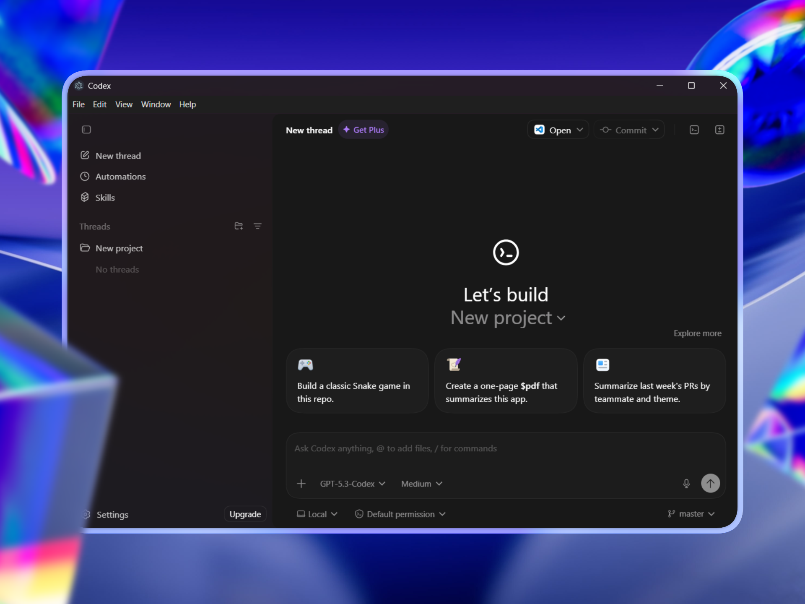

# Codex for Windows

**Run the Codex desktop app on Windows using the official macOS installer.**

A Windows runner that extracts the Codex DMG (macOS installer), rebuilds native modules for Windows, and runs—or packages—the full Electron app. No official Windows build exists; this project bridges the gap so you can use Codex on Windows with a single script or a portable `.exe`.



## Distinctive Features

### Run from DMG
- **One-time setup**: Download the latest Codex DMG from the [official website](https://codex.openai.com/) (or [Codex releases](https://github.com/openai/codex-app/releases)) and place it in the root directory of Codex-Windows (e.g. `Codex.dmg`).
- **No manual patching**: The script extracts the app, swaps macOS-only native modules for Windows builds (better-sqlite3, node-pty), and launches Codex.

### Portable build
- **Single-folder app**: Build a fully self-contained `Codex-win32-x64` folder with `Codex.exe`, bundled Codex CLI, and a Desktop shortcut.
- **Truly portable**: Move the **entire folder** anywhere (USB, another PC). No `run.ps1` or Node.js required after building.

### No official binaries shipped
- This repo **does not** ship OpenAI/Codex binaries. You supply the DMG and (for the first run) have the Codex CLI available (e.g. `npm i -g @openai/codex`). The portable build bundles the CLI into the output folder.

## Tech Stack

- **Runtime**: [Node.js](https://nodejs.org/) (for the build script)
- **Packaging**: [Electron](https://www.electronjs.org/) (version read from the app’s `package.json`)
- **Native modules**: better-sqlite3, node-pty (prebuilds or [Visual Studio Build Tools](https://visualstudio.microsoft.com/visual-cpp-build-tools/) for rebuild)
- **Script**: PowerShell (`run.ps1`), 7-Zip (auto-installed via `winget` if missing)

## Project Structure

```
Codex-Windows/
  Codex.dmg              # Place the DMG you download from the official website here
  image.png              # Preview image
  run.cmd                # Shortcut: run.cmd [options]
  scripts/
    run.ps1              # Main script: extract, patch, run or build exe
```

Generated output (extracted app, native builds, and the portable `Codex-win32-x64` folder) is created locally and is not part of the repo.

## Getting Started

### 1. Prerequisites

- **Windows 10 or 11**
- **Node.js** (for running the script)
- **7-Zip** — if not installed, the script will try `winget` or download a portable copy
- **Codex CLI** (for first run or if not building portable):  
  `npm i -g @openai/codex`

### 2. Codex macOS Installer (DMG)

- **Download the latest Codex DMG from the official website and place it in the root directory of Codex-Windows** (e.g. name it `Codex.dmg`).
- To use a different path or filename:  
  `.\scripts\run.ps1 -DmgPath .\path\to\YourCodex.dmg`

### 3. Install and run (quick run)

```powershell
# From repo root
.\scripts\run.ps1
```

Or with the shortcut:

```cmd
run.cmd
```

The script will extract the DMG, prepare the app, auto-detect `codex.exe`, and launch Codex.

### 4. Build a portable Codex.exe (recommended)

Build a self-contained app and a Desktop shortcut:

```powershell
.\scripts\run.ps1 -BuildExe
```

- A **Codex-win32-x64** folder is created (with `Codex.exe` and resources). A **Desktop shortcut** is also created—double-click it to launch.
- To move the app: move the **entire `Codex-win32-x64` folder**, then create a new shortcut to `Codex.exe` if needed.

> **Do not move only `Codex.exe`.** It needs the surrounding DLLs, `resources/`, and `locales/` folders.

**Build without launching:**

```powershell
.\scripts\run.ps1 -BuildExe -NoLaunch
```

## Usage summary

| Goal              | Command / Action                                      |
|-------------------|--------------------------------------------------------|
| Run once          | `.\scripts\run.ps1` or `run.cmd`                      |
| Build portable    | `.\scripts\run.ps1 -BuildExe`                         |
| Custom DMG        | `.\scripts\run.ps1 -DmgPath .\path\to\Codex.dmg`      |
| Reuse existing    | `.\scripts\run.ps1 -BuildExe -Reuse` (skips re-extract) |
| Custom work dir   | `.\scripts\run.ps1 -WorkDir .\mywork`                 |

---

**Creator:** [@dhruvtwt_](https://x.com/dhruvtwt_)
