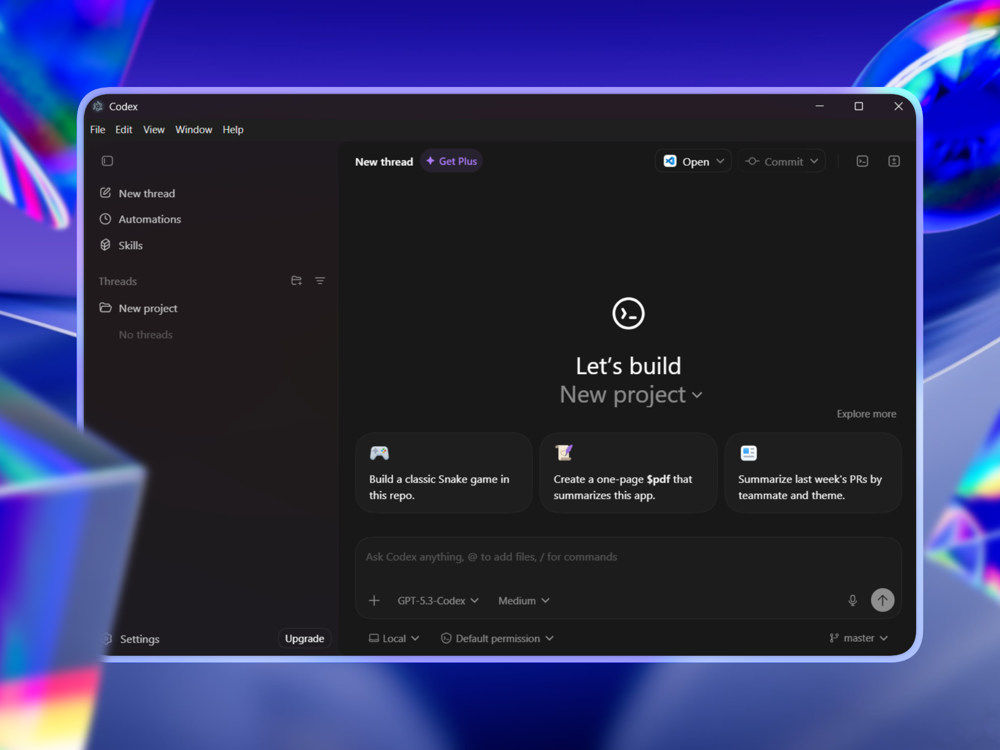

# Codex & Superset for Windows

**Run macOS-only Electron desktop apps on Windows using their official DMG installers.**

A set of Windows runner scripts that extract macOS DMGs, rebuild native modules for Windows, and run—or package—the full Electron apps. No official Windows builds exist; this project bridges the gap so you can use these apps on Windows with a single script or a portable `.exe`.



## Supported Apps

| App | DMG Source | Script | Wrapper |
|-----|-----------|--------|---------|
| **Codex** (OpenAI) | [codex.openai.com](https://codex.openai.com/) / [GitHub releases](https://github.com/openai/codex-app/releases) | `scripts\run.ps1` | `run.cmd` |
| **Superset** (superset.sh) | [GitHub releases](https://github.com/superset-sh/superset/releases) | `scripts\run-superset.ps1` | `run-superset.cmd` |

## Distinctive Features

### Run from DMG
- **One-time setup**: Download the DMG and place it in the repo root.
- **No manual patching**: The script extracts the app, swaps macOS-only native modules for Windows builds, and launches the app.

### Portable build
- **Single-folder app**: Build a fully self-contained folder with an `.exe`, and a Desktop shortcut.
- **Truly portable**: Move the **entire folder** anywhere (USB, another PC). No `.ps1` or Node.js required after building.

### No official binaries shipped
- This repo **does not** ship any app binaries. You supply the DMG. The portable build bundles everything into the output folder.

## Tech Stack

- **Runtime**: [Node.js](https://nodejs.org/) (for the build scripts)
- **Packaging**: [Electron](https://www.electronjs.org/) (version read from each app's `package.json`)
- **Native modules**: better-sqlite3, node-pty, @ast-grep/napi, libsql (prebuilds or [Visual Studio Build Tools](https://visualstudio.microsoft.com/visual-cpp-build-tools/) for rebuild)
- **Script**: PowerShell, 7-Zip (auto-installed via `winget` if missing)

## Project Structure

```
Codex-Windows/
  Codex.dmg                  # Codex DMG (you download this)
  Superset*.dmg              # Superset DMG (you download this)
  image.png                  # Preview image
  run.cmd                    # Codex shortcut
  run-superset.cmd           # Superset shortcut
  scripts/
    run.ps1                  # Codex: extract, patch, run or build exe
    run-superset.ps1         # Superset: extract, patch, run or build exe
```

Generated output is created locally in `work/` (Codex) and `work-superset/` (Superset) and is not part of the repo.

---

## Codex — Getting Started

### 1. Prerequisites

- **Windows 10 or 11**
- **Node.js** (for running the script)
- **7-Zip** — if not installed, the script will try `winget` or download a portable copy
- **Codex CLI** (for first run or if not building portable):  
  `npm i -g @openai/codex`

### 2. Codex macOS Installer (DMG)

- **Download the latest Codex DMG from the official website and place it in the root directory** (e.g. name it `Codex.dmg`).
- To use a different path or filename:  
  `.\scripts\run.ps1 -DmgPath .\path\to\YourCodex.dmg`

### 3. Install and run (quick run)

```powershell
# From repo root
.\scripts\run.ps1
```

Or with the shortcut:

```cmd
run.cmd
```

The script will extract the DMG, prepare the app, auto-detect `codex.exe`, and launch Codex.

### 4. Build a portable Codex.exe (recommended)

```powershell
.\scripts\run.ps1 -BuildExe
```

- A **Codex-win32-x64** folder is created (with `Codex.exe` and resources). A **Desktop shortcut** is also created.
- To move the app: move the **entire `Codex-win32-x64` folder**, then create a new shortcut to `Codex.exe` if needed.

> **Do not move only `Codex.exe`.** It needs the surrounding DLLs, `resources/`, and `locales/` folders.

**Build without launching:**

```powershell
.\scripts\run.ps1 -BuildExe -NoLaunch
```

### Codex usage summary

| Goal              | Command / Action                                      |
|-------------------|--------------------------------------------------------|
| Run once          | `.\scripts\run.ps1` or `run.cmd`                      |
| Build portable    | `.\scripts\run.ps1 -BuildExe`                         |
| Custom DMG        | `.\scripts\run.ps1 -DmgPath .\path\to\Codex.dmg`      |
| Reuse existing    | `.\scripts\run.ps1 -BuildExe -Reuse` (skips re-extract) |
| Custom work dir   | `.\scripts\run.ps1 -WorkDir .\mywork`                 |

---

## Superset — Getting Started

### 1. Prerequisites

- **Windows 10 or 11**
- **Node.js** (for running the script)
- **7-Zip** — if not installed, the script will try `winget` or download a portable copy
- **Git** (recommended — Superset uses Git worktrees)

### 2. Superset macOS Installer (DMG)

- Download the latest Superset DMG from [GitHub releases](https://github.com/superset-sh/superset/releases) and place it in the repo root (e.g. name it `Superset.dmg`).
- To use a different path or filename:  
  `.\scripts\run-superset.ps1 -DmgPath .\path\to\Superset-arm64.dmg`

### 3. Install and run (quick run)

```powershell
.\scripts\run-superset.ps1
```

Or with the shortcut:

```cmd
run-superset.cmd -DmgPath .\Superset.dmg
```

The script extracts the DMG, auto-discovers the `.app` bundle, rebuilds native modules (better-sqlite3, node-pty, @ast-grep/napi, libsql) for Windows, patches for portability, and launches Superset.

### 4. Build a portable Superset.exe (recommended)

```powershell
.\scripts\run-superset.ps1 -BuildExe
```

- A **Superset-win32-x64** folder is created with `Superset.exe` and a **Desktop shortcut**.
- Move the **entire folder** to relocate; do not move the exe alone.

**Build without launching:**

```powershell
.\scripts\run-superset.ps1 -BuildExe -NoLaunch
```

### Superset usage summary

| Goal              | Command / Action                                               |
|-------------------|----------------------------------------------------------------|
| Run once          | `.\scripts\run-superset.ps1 -DmgPath .\Superset.dmg`          |
| Build portable    | `.\scripts\run-superset.ps1 -BuildExe`                        |
| Reuse existing    | `.\scripts\run-superset.ps1 -BuildExe -Reuse`                 |
| Custom work dir   | `.\scripts\run-superset.ps1 -WorkDir .\mywork`                |

### Superset native modules

The Superset desktop app uses four native Node.js modules that must be rebuilt for Windows:

| Module | Purpose |
|--------|---------|
| **better-sqlite3** | Local SQLite database |
| **node-pty** | Terminal/PTY for running coding agents |
| **@ast-grep/napi** | Code analysis (AST pattern matching) |
| **libsql** | LibSQL database driver |

The script automatically installs the correct Windows platform packages (e.g. `@ast-grep/napi-win32-x64-msvc`, `@libsql/win32-x64-msvc`) and removes macOS-only binaries.

---

## Notes

- This is **not** an official OpenAI or Superset project.
- Do **not** redistribute any app DMGs or binaries; use your own installers.
- **Native modules**: If compilation fails (e.g. no Visual Studio), the script tries prebuilt binaries. If none are available for your Electron version, install [Visual Studio Build Tools](https://visualstudio.microsoft.com/visual-cpp-build-tools/) and run again.
  
---

**Creator:** [@dhruvtwt_](https://x.com/dhruvtwt_)
